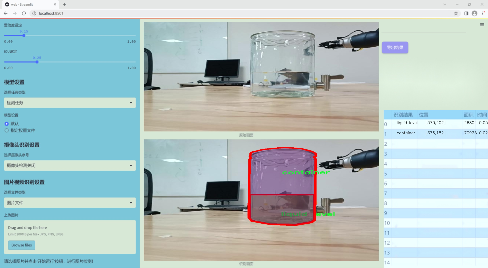
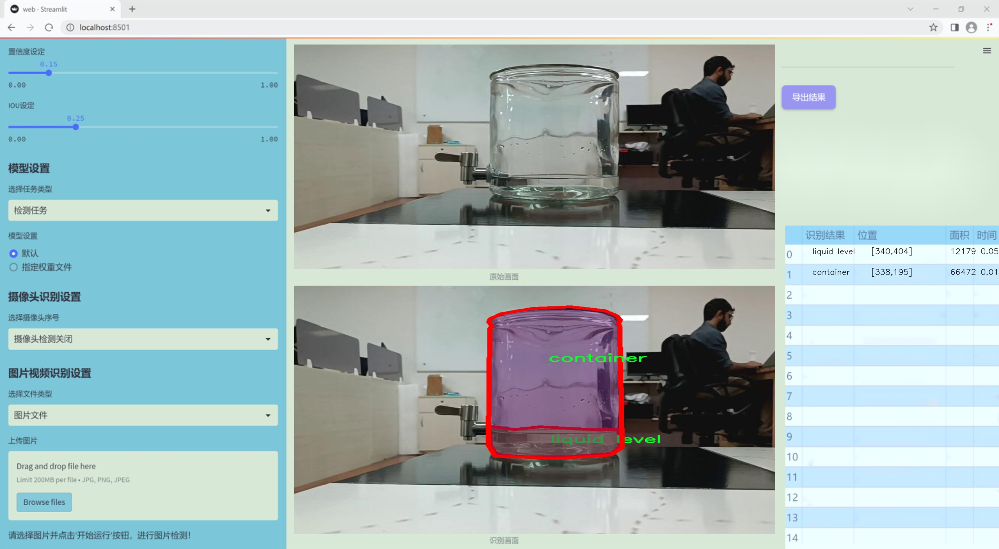
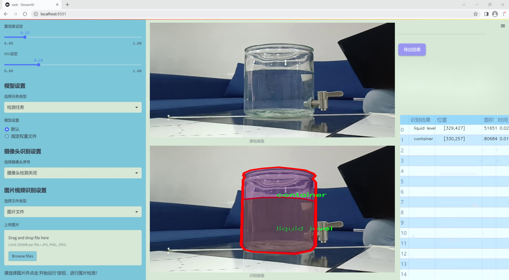
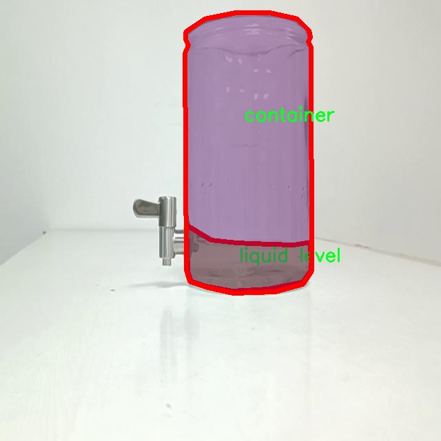
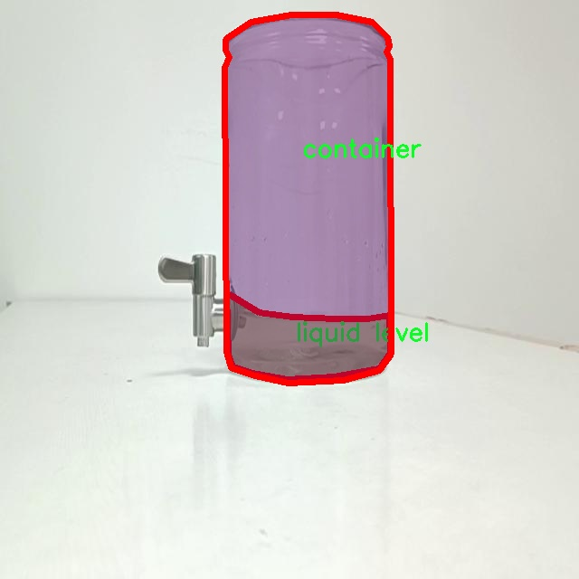
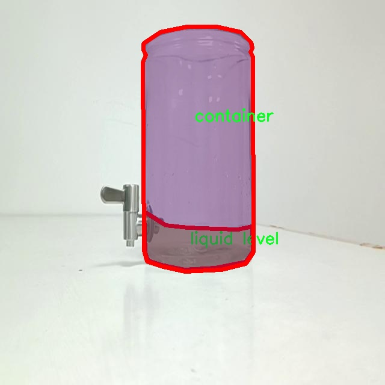
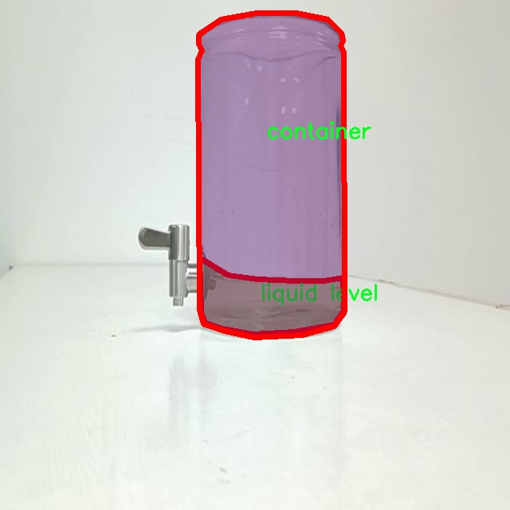

### 1.背景意义

研究背景与意义

随着智能家居和物联网技术的迅速发展，水位监测系统在家庭和工业应用中变得愈发重要。水位检测不仅可以帮助用户实时了解水体状态，还能在水位异常时及时发出警报，从而避免潜在的财产损失和安全隐患。传统的水位检测方法多依赖于机械传感器，这些方法在准确性、耐用性和维护成本等方面存在一定的局限性。因此，基于计算机视觉的水位检测系统逐渐成为研究的热点。

在这一背景下，基于改进YOLOv11的瓶中水位检测系统应运而生。YOLO（You Only Look Once）系列模型以其高效的实时目标检测能力而闻名，尤其适合处理复杂的视觉任务。通过对YOLOv11进行改进，我们可以提升其在水位检测中的准确性和鲁棒性。该系统利用3000张经过精心标注的图像数据集，涵盖了“容器”和“液位”两个类别，为模型的训练提供了丰富的样本支持。

数据集的设计考虑到了实际应用中的多样性和复杂性。每张图像都经过预处理，确保模型在训练过程中能够有效学习到水位的特征。这种基于实例分割的检测方法，不仅能够准确识别容器的边界，还能精确定位液位的高度，从而为用户提供直观的水位信息。

通过这一研究，我们希望能够为水位监测领域提供一种高效、可靠的解决方案，推动智能水位检测技术的发展。同时，该系统的成功实施也将为其他类似的计算机视觉应用提供借鉴，促进相关技术的广泛应用与推广。

### 2.视频效果

[2.1 视频效果](https://www.bilibili.com/video/BV17jCFY5EHt/)

### 3.图片效果







##### [项目涉及的源码数据来源链接](https://kdocs.cn/l/cszuIiCKVNis)**

注意：本项目提供训练的数据集和训练教程,由于版本持续更新,暂不提供权重文件（best.pt）,请按照6.训练教程进行训练后实现上图演示的效果。

### 4.数据集信息

##### 4.1 本项目数据集类别数＆类别名

nc: 2
names: ['container', 'liquid level']


该项目为【图像分割】数据集，请在【训练教程和Web端加载模型教程（第三步）】这一步的时候按照【图像分割】部分的教程来训练

##### 4.2 本项目数据集信息介绍

本项目数据集信息介绍

本项目旨在开发一个改进的YOLOv11瓶中水位检测系统，为此我们构建了一个专门的数据集，以支持模型的训练和优化。该数据集的主题围绕“水位检测”，其主要目的是准确识别和定位容器中的液体水平。数据集中包含两个主要类别，分别为“container”（容器）和“liquid level”（液体水平），通过这两个类别的标注，模型能够有效地学习到容器的形状特征以及液体在容器中的高度变化。

在数据集的构建过程中，我们收集了多种不同类型的容器样本，包括玻璃瓶、塑料瓶和金属罐等，以确保模型能够适应不同材质和形状的容器。此外，为了增强模型的泛化能力，我们还考虑了不同的环境因素，如光照变化、背景杂乱程度和液体颜色等。这些因素的多样性使得数据集更加丰富，能够为YOLOv11提供更为全面的训练数据。

数据集中的每个样本都经过精确的标注，确保“container”和“liquid level”这两个类别的边界框能够准确反映实际情况。通过这样的标注方式，模型在训练过程中能够学习到容器的边界以及液体水平的特征，从而提高检测的准确性和鲁棒性。我们相信，通过使用这个精心构建的数据集，改进后的YOLOv11将能够在实际应用中实现高效、准确的水位检测，为相关领域的研究和应用提供有力支持。










### 5.全套项目环境部署视频教程（零基础手把手教学）

[5.1 所需软件PyCharm和Anaconda安装教程（第一步）](https://www.bilibili.com/video/BV1BoC1YCEKi/?spm_id_from=333.999.0.0&vd_source=bc9aec86d164b67a7004b996143742dc)


[5.2 安装Python虚拟环境创建和依赖库安装视频教程（第二步）](https://www.bilibili.com/video/BV1ZoC1YCEBw?spm_id_from=333.788.videopod.sections&vd_source=bc9aec86d164b67a7004b996143742dc)

### 6.改进YOLOv11训练教程和Web_UI前端加载模型教程（零基础手把手教学）

[6.1 改进YOLOv11训练教程和Web_UI前端加载模型教程（第三步）](https://www.bilibili.com/video/BV1BoC1YCEhR?spm_id_from=333.788.videopod.sections&vd_source=bc9aec86d164b67a7004b996143742dc)


按照上面的训练视频教程链接加载项目提供的数据集，运行train.py即可开始训练



     Epoch   gpu_mem       box       obj       cls    labels  img_size
     1/200     20.8G   0.01576   0.01955  0.007536        22      1280: 100%|██████████| 849/849 [14:42<00:00,  1.04s/it]
               Class     Images     Labels          P          R     mAP@.5 mAP@.5:.95: 100%|██████████| 213/213 [01:14<00:00,  2.87it/s]
                 all       3395      17314      0.994      0.957      0.0957      0.0843

     Epoch   gpu_mem       box       obj       cls    labels  img_size
     2/200     20.8G   0.01578   0.01923  0.007006        22      1280: 100%|██████████| 849/849 [14:44<00:00,  1.04s/it]
               Class     Images     Labels          P          R     mAP@.5 mAP@.5:.95: 100%|██████████| 213/213 [01:12<00:00,  2.95it/s]
                 all       3395      17314      0.996      0.956      0.0957      0.0845

     Epoch   gpu_mem       box       obj       cls    labels  img_size
     3/200     20.8G   0.01561    0.0191  0.006895        27      1280: 100%|██████████| 849/849 [10:56<00:00,  1.29it/s]
               Class     Images     Labels          P          R     mAP@.5 mAP@.5:.95: 100%|███████   | 187/213 [00:52<00:00,  4.04it/s]
                 all       3395      17314      0.996      0.957      0.0957      0.0845


###### [项目数据集下载链接](https://kdocs.cn/l/cszuIiCKVNis)

### 7.原始YOLOv11算法讲解

##### YOLO11简介

> YOLO11源码地址：https://github.com/ultralytics/ultralytics

Ultralytics
YOLO11是一款尖端的、最先进的模型，它在之前YOLO版本成功的基础上进行了构建，并引入了新功能和改进，以进一步提升性能和灵活性。YOLO11设计快速、准确且易于使用，使其成为各种物体检测和跟踪、实例分割、图像分类以及姿态估计任务的绝佳选择。  


**YOLO11创新点如下:**

YOLO 11主要改进包括：  
`增强的特征提取`：YOLO 11采用了改进的骨干和颈部架构，增强了特征提取功能，以实现更精确的目标检测。  
`优化的效率和速度`：优化的架构设计和优化的训练管道提供更快的处理速度，同时保持准确性和性能之间的平衡。  
`更高的精度，更少的参数`：YOLO11m在COCO数据集上实现了更高的平均精度（mAP），参数比YOLOv8m少22%，使其在不影响精度的情况下提高了计算效率。  
`跨环境的适应性`：YOLO 11可以部署在各种环境中，包括边缘设备、云平台和支持NVIDIA GPU的系统。  
`广泛的支持任务`：YOLO 11支持各种计算机视觉任务，如对象检测、实例分割、图像分类、姿态估计和面向对象检测（OBB）。

**YOLO11不同模型尺寸信息：**

YOLO11 提供5种不同的型号规模模型，以满足不同的应用需求：

Model| size (pixels)| mAPval 50-95| Speed CPU ONNX (ms)| Speed T4 TensorRT10
(ms)| params (M)| FLOPs (B)  
---|---|---|---|---|---|---  
YOLO11n| 640| 39.5| 56.1 ± 0.8| 1.5 ± 0.0| 2.6| 6.5  
YOLO11s| 640| 47.0| 90.0 ± 1.2| 2.5 ± 0.0| 9.4| 21.5  
YOLO11m| 640| 51.5| 183.2 ± 2.0| 4.7 ± 0.1| 20.1| 68.0  
YOLO11l| 640| 53.4| 238.6 ± 1.4| 6.2 ± 0.1| 25.3| 86.9  
YOLO11x| 640| 54.7| 462.8 ± 6.7| 11.3 ± 0.2| 56.9| 194.9  
  
**模型常用训练超参数参数说明：**  
`YOLOv11
模型的训练设置包括训练过程中使用的各种超参数和配置`。这些设置会影响模型的性能、速度和准确性。关键的训练设置包括批量大小、学习率、动量和权重衰减。此外，优化器、损失函数和训练数据集组成的选择也会影响训练过程。对这些设置进行仔细的调整和实验对于优化性能至关重要。  
**以下是一些常用的模型训练参数和说明：**

参数名| 默认值| 说明  
---|---|---  
`model`| `None`| 指定用于训练的模型文件。接受指向 `.pt` 预训练模型或 `.yaml`
配置文件。对于定义模型结构或初始化权重至关重要。  
`data`| `None`| 数据集配置文件的路径（例如
`coco8.yaml`).该文件包含特定于数据集的参数，包括训练数据和验证数据的路径、类名和类数。  
`epochs`| `100`| 训练总轮数。每个epoch代表对整个数据集进行一次完整的训练。调整该值会影响训练时间和模型性能。  
`patience`| `100`| 在验证指标没有改善的情况下，提前停止训练所需的epoch数。当性能趋于平稳时停止训练，有助于防止过度拟合。  
`batch`| `16`| 批量大小，有三种模式:设置为整数(例如，’ Batch =16 ‘)， 60% GPU内存利用率的自动模式(’ Batch
=-1 ‘)，或指定利用率分数的自动模式(’ Batch =0.70 ')。  
`imgsz`| `640`| 用于训练的目标图像尺寸。所有图像在输入模型前都会被调整到这一尺寸。影响模型精度和计算复杂度。  
`device`| `None`| 指定用于训练的计算设备：单个 GPU (`device=0`）、多个 GPU (`device=0,1`)、CPU
(`device=cpu`)，或苹果芯片的 MPS (`device=mps`).  
`workers`| `8`| 加载数据的工作线程数（每 `RANK` 多 GPU 训练）。影响数据预处理和输入模型的速度，尤其适用于多 GPU 设置。  
`name`| `None`| 训练运行的名称。用于在项目文件夹内创建一个子目录，用于存储训练日志和输出结果。  
`pretrained`| `True`| 决定是否从预处理模型开始训练。可以是布尔值，也可以是加载权重的特定模型的字符串路径。提高训练效率和模型性能。  
`optimizer`| `'auto'`| 为训练模型选择优化器。选项包括 `SGD`, `Adam`, `AdamW`, `NAdam`,
`RAdam`, `RMSProp` 等，或 `auto` 用于根据模型配置进行自动选择。影响收敛速度和稳定性  
`lr0`| `0.01`| 初始学习率（即 `SGD=1E-2`, `Adam=1E-3`) .调整这个值对优化过程至关重要，会影响模型权重的更新速度。  
`lrf`| `0.01`| 最终学习率占初始学习率的百分比 = (`lr0 * lrf`)，与调度程序结合使用，随着时间的推移调整学习率。  


**各损失函数作用说明：**  
`定位损失box_loss`：预测框与标定框之间的误差（GIoU），越小定位得越准；  
`分类损失cls_loss`：计算锚框与对应的标定分类是否正确，越小分类得越准；  
`动态特征损失（dfl_loss）`：DFLLoss是一种用于回归预测框与目标框之间距离的损失函数。在计算损失时，目标框需要缩放到特征图尺度，即除以相应的stride，并与预测的边界框计算Ciou
Loss，同时与预测的anchors中心点到各边的距离计算回归DFLLoss。  


### 8.200+种全套改进YOLOV11创新点原理讲解

#### 8.1 200+种全套改进YOLOV11创新点原理讲解大全

由于篇幅限制，每个创新点的具体原理讲解就不全部展开，具体见下列网址中的改进模块对应项目的技术原理博客网址【Blog】（创新点均为模块化搭建，原理适配YOLOv5~YOLOv11等各种版本）

[改进模块技术原理博客【Blog】网址链接](https://gitee.com/qunmasj/good)


#### 8.2 精选部分改进YOLOV11创新点原理讲解

###### 这里节选部分改进创新点展开原理讲解(完整的改进原理见上图和[改进模块技术原理博客链接](https://gitee.com/qunmasj/good)【如果此小节的图加载失败可以通过CSDN或者Github搜索该博客的标题访问原始博客，原始博客图片显示正常】


### YOLO-MS简介
实时目标检测，以YOLO系列为例，已在工业领域中找到重要应用，特别是在边缘设备（如无人机和机器人）中。与之前的目标检测器不同，实时目标检测器旨在在速度和准确性之间追求最佳平衡。为了实现这一目标，提出了大量的工作：从第一代DarkNet到CSPNet，再到最近的扩展ELAN，随着性能的快速增长，实时目标检测器的架构经历了巨大的变化。

尽管性能令人印象深刻，但在不同尺度上识别对象仍然是实时目标检测器面临的基本挑战。这促使作者设计了一个强大的编码器架构，用于学习具有表现力的多尺度特征表示。具体而言，作者从两个新的角度考虑为实时目标检测编码多尺度特征：

从局部视角出发，作者设计了一个具有简单而有效的分层特征融合策略的MS-Block。受到Res2Net的启发，作者在MS-Block中引入了多个分支来进行特征提取，但不同的是，作者使用了一个带有深度卷积的 Inverted Bottleneck Block块，以实现对大Kernel的高效利用。

从全局视角出发，作者提出随着网络加深逐渐增加卷积的Kernel-Size。作者在浅层使用小Kernel卷积来更高效地处理高分辨率特征。另一方面，在深层中，作者采用大Kernel卷积来捕捉广泛的信息。

基于以上设计原则，作者呈现了作者的实时目标检测器，称为YOLO-MS。为了评估作者的YOLO-MS的性能，作者在MS COCO数据集上进行了全面的实验。还提供了与其他最先进方法的定量比较，以展示作者方法的强大性能。如图1所示，YOLO-MS在计算性能平衡方面优于其他近期的实时目标检测器。


具体而言，YOLO-MS-XS在MS COCO上获得了43%+的AP得分，仅具有450万个可学习参数和8.7亿个FLOPs。YOLO-MS-S和YOLO-MS分别获得了46%+和51%+的AP，可学习参数分别为810万和2220万。此外，作者的工作还可以作为其他YOLO模型的即插即用模块。通常情况下，作者的方法可以将YOLOv11的AP从37%+显著提高到40%+，甚至还可以使用更少的参数和FLOPs。


#### Multi-Scale Building Block Design
CSP Block是一个基于阶段级梯度路径的网络，平衡了梯度组合和计算成本。它是广泛应用于YOLO系列的基本构建块。已经提出了几种变体，包括YOLOv4和YOLOv11中的原始版本，Scaled YOLOv4中的CSPVoVNet，YOLOv11中的ELAN，以及RTMDet中提出的大Kernel单元。作者在图2(a)和图2(b)中分别展示了原始CSP块和ELAN的结构。


上述实时检测器中被忽视的一个关键方面是如何在基本构建块中编码多尺度特征。其中一个强大的设计原则是Res2Net，它聚合了来自不同层次的特征以增强多尺度表示。然而，这一原则并没有充分探索大Kernel卷积的作用，而大Kernel卷积已经在基于CNN的视觉识别任务模型中证明有效。将大Kernel卷积纳入Res2Net的主要障碍在于它们引入的计算开销，因为构建块采用了标准卷积。在作者的方法中，作者提出用 Inverted Bottleneck Block替代标准的3 × 3卷积，以享受大Kernel卷积的好处。

基于前面的分析，作者提出了一个带有分层特征融合策略的全新Block，称为MS-Block，以增强实时目标检测器在提取多尺度特征时的能力，同时保持快速的推理速度。

MS-Block的具体结构如图2(c)所示。假设是输入特征。通过1×1卷积的转换后，X的通道维度增加到n*C。然后，作者将X分割成n个不同的组，表示为，其中。为了降低计算成本，作者选择n为3。

注意，除了之外，每个其他组都经过一个 Inverted Bottleneck Block层，用表示，其中k表示Kernel-Size，以获得。的数学表示如下：


根据这个公式，该博客的作者不将 Inverted Bottleneck Block层连接，使其作为跨阶段连接，并保留来自前面层的信息。最后，作者将所有分割连接在一起，并应用1×1卷积来在所有分割之间进行交互，每个分割都编码不同尺度的特征。当网络加深时，这个1×1卷积也用于调整通道数。

#### Heterogeneous Kernel Selection Protocol
除了构建块的设计外，作者还从宏观角度探讨了卷积的使用。之前的实时目标检测器在不同的编码器阶段采用了同质卷积（即具有相同Kernel-Size的卷积），但作者认为这不是提取多尺度语义信息的最佳选项。

在金字塔结构中，从检测器的浅阶段提取的高分辨率特征通常用于捕捉细粒度语义，将用于检测小目标。相反，来自网络较深阶段的低分辨率特征用于捕捉高级语义，将用于检测大目标。如果作者在所有阶段都采用统一的小Kernel卷积，深阶段的有效感受野（ERF）将受到限制，影响大目标的性能。在每个阶段中引入大Kernel卷积可以帮助解决这个问题。然而，具有大的ERF的大Kernel可以编码更广泛的区域，这增加了在小目标外部包含噪声信息的概率，并且降低了推理速度。

在这项工作中，作者建议在不同阶段中采用异构卷积，以帮助捕获更丰富的多尺度特征。具体来说，在编码器的第一个阶段中，作者采用最小Kernel卷积，而最大Kernel卷积位于最后一个阶段。随后，作者逐步增加中间阶段的Kernel-Size，使其与特征分辨率的增加保持一致。这种策略允许提取细粒度和粗粒度的语义信息，增强了编码器的多尺度特征表示能力。

正如图所示，作者将k的值分别分配给编码器中的浅阶段到深阶段，取值为3、5、7和9。作者将其称为异构Kernel选择（HKS）协议。


作者的HKS协议能够在深层中扩大感受野，而不会对浅层产生任何其他影响。此外，HKS不仅有助于编码更丰富的多尺度特征，还确保了高效的推理。

如表1所示，将大Kernel卷积应用于高分辨率特征会产生较高的计算开销。然而，作者的HKS协议在低分辨率特征上采用大Kernel卷积，从而与仅使用大Kernel卷积相比，大大降低了计算成本。


在实践中，作者经验性地发现，采用HKS协议的YOLO-MS的推理速度几乎与仅使用深度可分离的3 × 3卷积相同。

#### Architecture
如图所示，作者模型的Backbone由4个阶段组成，每个阶段后面跟随1个步长为2的3 × 3卷积进行下采样。在第3个阶段后，作者添加了1个SPP块，与RTMDet中一样。在作者的编码器上，作者使用PAFPN作为Neck来构建特征金字塔[31, 35]。它融合了从Backbone不同阶段提取的多尺度特征。Neck中使用的基本构建块也是作者的MS-Block，在其中使用3 × 3深度可分离卷积进行快速推理。

此外，为了在速度和准确性之间取得更好的平衡，作者将Backbone中多级特征的通道深度减半。作者提供了3个不同尺度的YOLO-MS变体，即YOLO-MS-XS、YOLO-MS-S和YOLO-MS。不同尺度的YOLO-MS的详细配置列在表2中。对于YOLO-MS的其他部分，作者将其保持与RTMDet相同。


### 9.系统功能展示

图9.1.系统支持检测结果表格显示

  图9.2.系统支持置信度和IOU阈值手动调节

  图9.3.系统支持自定义加载权重文件best.pt(需要你通过步骤5中训练获得)

  图9.4.系统支持摄像头实时识别

  图9.5.系统支持图片识别

  图9.6.系统支持视频识别

  图9.7.系统支持识别结果文件自动保存

  图9.8.系统支持Excel导出检测结果数据


### 10. YOLOv11核心改进源码讲解

#### 10.1 val.py

以下是对给定代码的核心部分进行提炼和详细注释的结果：

```python
import os
import torch
from ultralytics.engine.validator import BaseValidator
from ultralytics.utils.metrics import DetMetrics, box_iou
from ultralytics.utils import LOGGER, ops

class DetectionValidator(BaseValidator):
    """
    扩展自BaseValidator类的检测模型验证器，用于基于检测模型的验证。
    """

    def __init__(self, dataloader=None, save_dir=None, pbar=None, args=None, _callbacks=None):
        """初始化检测模型所需的变量和设置。"""
        super().__init__(dataloader, save_dir, pbar, args, _callbacks)
        self.metrics = DetMetrics(save_dir=self.save_dir)  # 初始化检测指标
        self.iouv = torch.linspace(0.5, 0.95, 10)  # IoU向量，用于计算mAP@0.5:0.95

    def preprocess(self, batch):
        """对YOLO训练的图像批次进行预处理。"""
        # 将图像数据移动到设备上并进行归一化处理
        batch["img"] = batch["img"].to(self.device, non_blocking=True) / 255
        batch["img"] = batch["img"].half() if self.args.half else batch["img"].float()
        for k in ["batch_idx", "cls", "bboxes"]:
            batch[k] = batch[k].to(self.device)  # 将其他数据也移动到设备上
        return batch

    def postprocess(self, preds):
        """对预测输出应用非极大值抑制（NMS）。"""
        return ops.non_max_suppression(
            preds,
            self.args.conf,
            self.args.iou,
            multi_label=True,
            agnostic=self.args.single_cls,
            max_det=self.args.max_det,
        )

    def update_metrics(self, preds, batch):
        """更新检测指标。"""
        for si, pred in enumerate(preds):
            # 处理每个样本的预测结果
            pbatch = self._prepare_batch(si, batch)  # 准备批次数据
            cls, bbox = pbatch.pop("cls"), pbatch.pop("bbox")  # 获取真实标签
            if len(pred) == 0:  # 如果没有检测到目标
                continue

            predn = self._prepare_pred(pred, pbatch)  # 准备预测数据
            # 计算正确预测
            self._process_batch(predn, bbox, cls)

    def _process_batch(self, detections, gt_bboxes, gt_cls):
        """
        返回正确预测矩阵。

        参数:
            detections (torch.Tensor): 形状为[N, 6]的检测张量。
            gt_bboxes (torch.Tensor): 形状为[M, 5]的真实标签张量。

        返回:
            (torch.Tensor): 形状为[N, 10]的正确预测矩阵。
        """
        iou = box_iou(gt_bboxes, detections[:, :4])  # 计算IoU
        return self.match_predictions(detections[:, 5], gt_cls, iou)  # 匹配预测与真实标签

    def get_stats(self):
        """返回指标统计和结果字典。"""
        stats = {k: torch.cat(v, 0).cpu().numpy() for k, v in self.stats.items()}  # 转换为numpy
        if len(stats) and stats["tp"].any():
            self.metrics.process(**stats)  # 处理指标
        return self.metrics.results_dict  # 返回结果字典

    def print_results(self):
        """打印每个类别的训练/验证集指标。"""
        pf = "%22s" + "%11i" * 2 + "%11.3g" * len(self.metrics.keys)  # 打印格式
        LOGGER.info(pf % ("all", self.seen, self.nt_per_class.sum(), *self.metrics.mean_results()))  # 打印总体结果
```

### 核心部分分析：
1. **类的定义与初始化**：`DetectionValidator`类继承自`BaseValidator`，用于处理YOLO模型的验证。初始化时设置了一些重要的变量，如检测指标和IoU范围。

2. **数据预处理**：`preprocess`方法负责将输入图像进行归一化和设备转移，为后续的模型推理做准备。

3. **后处理**：`postprocess`方法应用非极大值抑制（NMS）来过滤掉冗余的检测框，以提高检测结果的准确性。

4. **指标更新**：`update_metrics`方法在每个批次上更新检测指标，处理预测结果和真实标签的匹配。

5. **IoU计算与匹配**：`_process_batch`方法计算预测框与真实框之间的IoU，并返回正确的预测矩阵。

6. **统计结果**：`get_stats`方法汇总统计信息，并返回最终的指标结果。

7. **结果打印**：`print_results`方法用于输出每个类别的检测结果，便于用户查看模型性能。

以上是对代码的核心部分进行了提炼和详细注释，突出了每个方法的功能和重要性。

这个程序文件 `val.py` 是一个用于目标检测模型验证的类实现，主要是基于 YOLO（You Only Look Once）模型的验证过程。文件中导入了一些必要的库和模块，包括文件操作、数值计算、深度学习框架 PyTorch 以及 Ultralytics 提供的工具和方法。

在文件中，定义了一个名为 `DetectionValidator` 的类，它继承自 `BaseValidator`。这个类的主要功能是对 YOLO 模型进行验证，包括数据预处理、模型评估、结果输出等。构造函数中初始化了一些变量和设置，包括类别数量、是否使用 COCO 数据集、任务类型等，同时也初始化了用于计算检测指标的 `DetMetrics` 类和混淆矩阵。

`preprocess` 方法用于对输入的图像批次进行预处理，包括将图像转换为适合模型输入的格式，调整图像的数值范围，并处理边界框信息。`init_metrics` 方法则用于初始化评估指标，确定数据集的类型，并设置相关的统计信息。

`get_desc` 方法返回一个格式化的字符串，用于总结每个类别的指标信息。`postprocess` 方法则对模型的预测结果应用非极大值抑制（NMS），以减少冗余的检测框。

`_prepare_batch` 和 `_prepare_pred` 方法用于准备验证过程中所需的图像和标注数据，确保它们的格式和尺寸适合后续处理。`update_metrics` 方法是更新模型评估指标的核心部分，它处理每个预测结果，并将其与真实标签进行比较，计算出正确预测的数量和相关统计信息。

`finalize_metrics` 方法用于设置最终的指标值，`get_stats` 方法返回当前的指标统计信息。`print_results` 方法则负责打印每个类别的验证结果，包括每个类别的检测数量和性能指标。

`build_dataset` 和 `get_dataloader` 方法用于构建数据集和数据加载器，以便在验证过程中加载图像和标注。`plot_val_samples` 和 `plot_predictions` 方法用于可视化验证样本和模型的预测结果，便于分析模型的性能。

最后，`save_one_txt` 和 `pred_to_json` 方法用于将模型的预测结果保存为文本文件或 JSON 格式，以便后续分析和评估。`eval_json` 方法则用于评估 YOLO 输出的 JSON 格式结果，并返回性能统计信息，特别是与 COCO 数据集相关的评估。

整体来看，这个文件实现了一个完整的目标检测模型验证流程，涵盖了从数据预处理到结果评估的各个环节，适用于使用 YOLO 模型进行目标检测任务的场景。

#### 10.2 metaformer.py

以下是保留的核心代码部分，并附上详细的中文注释：

```python
import torch
import torch.nn as nn
import torch.nn.functional as F

class MF_Attention(nn.Module):
    """
    自注意力机制的实现，参考Transformer论文。
    """
    def __init__(self, dim, head_dim=32, num_heads=None, qkv_bias=False,
                 attn_drop=0., proj_drop=0., proj_bias=False):
        super().__init__()

        # 头的维度
        self.head_dim = head_dim
        # 缩放因子
        self.scale = head_dim ** -0.5

        # 计算头的数量
        self.num_heads = num_heads if num_heads else dim // head_dim
        if self.num_heads == 0:
            self.num_heads = 1
        
        # 注意力维度
        self.attention_dim = self.num_heads * self.head_dim

        # 定义线性层用于计算Q、K、V
        self.qkv = nn.Linear(dim, self.attention_dim * 3, bias=qkv_bias)
        # 注意力的dropout层
        self.attn_drop = nn.Dropout(attn_drop)
        # 输出的线性层
        self.proj = nn.Linear(self.attention_dim, dim, bias=proj_bias)
        # 输出的dropout层
        self.proj_drop = nn.Dropout(proj_drop)

    def forward(self, x):
        # 获取输入的批量大小、高度、宽度和通道数
        B, H, W, C = x.shape
        N = H * W  # 计算总的token数量

        # 计算Q、K、V
        qkv = self.qkv(x).reshape(B, N, 3, self.num_heads, self.head_dim).permute(2, 0, 3, 1, 4)
        q, k, v = qkv.unbind(0)  # 分离Q、K、V

        # 计算注意力分数
        attn = (q @ k.transpose(-2, -1)) * self.scale
        attn = attn.softmax(dim=-1)  # 归一化为概率分布
        attn = self.attn_drop(attn)  # 应用dropout

        # 计算输出
        x = (attn @ v).transpose(1, 2).reshape(B, H, W, self.attention_dim)
        x = self.proj(x)  # 线性变换
        x = self.proj_drop(x)  # 应用dropout
        return x  # 返回输出

class MetaFormerBlock(nn.Module):
    """
    MetaFormer块的实现。
    """
    def __init__(self, dim,
                 token_mixer=nn.Identity, mlp=Mlp,
                 norm_layer=partial(LayerNormWithoutBias, eps=1e-6),
                 drop=0., drop_path=0.,
                 layer_scale_init_value=None, res_scale_init_value=None):
        super().__init__()

        # 第一层归一化
        self.norm1 = norm_layer(dim)
        # 令牌混合器
        self.token_mixer = token_mixer(dim=dim, drop=drop)
        # 路径丢弃
        self.drop_path1 = DropPath(drop_path) if drop_path > 0. else nn.Identity()
        # 层缩放
        self.layer_scale1 = Scale(dim=dim, init_value=layer_scale_init_value) if layer_scale_init_value else nn.Identity()
        self.res_scale1 = Scale(dim=dim, init_value=res_scale_init_value) if res_scale_init_value else nn.Identity()

        # 第二层归一化
        self.norm2 = norm_layer(dim)
        # MLP层
        self.mlp = mlp(dim=dim, drop=drop)
        # 路径丢弃
        self.drop_path2 = DropPath(drop_path) if drop_path > 0. else nn.Identity()
        # 层缩放
        self.layer_scale2 = Scale(dim=dim, init_value=layer_scale_init_value) if layer_scale_init_value else nn.Identity()
        self.res_scale2 = Scale(dim=dim, init_value=res_scale_init_value) if res_scale_init_value else nn.Identity()

    def forward(self, x):
        # 转换维度以适应后续操作
        x = x.permute(0, 2, 3, 1)
        # 第一部分前向传播
        x = self.res_scale1(x) + \
            self.layer_scale1(
                self.drop_path1(
                    self.token_mixer(self.norm1(x))
                )
            )
        # 第二部分前向传播
        x = self.res_scale2(x) + \
            self.layer_scale2(
                self.drop_path2(
                    self.mlp(self.norm2(x))
                )
            )
        return x.permute(0, 3, 1, 2)  # 恢复原始维度
```

### 代码核心部分说明：
1. **MF_Attention**: 实现了自注意力机制，计算输入的Q、K、V并生成注意力输出。
2. **MetaFormerBlock**: 实现了一个MetaFormer块，包含归一化、令牌混合、MLP和残差连接等操作。

以上代码部分是实现MetaFormer架构的核心，主要用于处理输入数据并生成特征表示。

这个程序文件 `metaformer.py` 实现了一种名为 MetaFormer 的神经网络架构，主要用于图像处理和计算机视觉任务。文件中包含多个类，每个类代表了 MetaFormer 的不同组件和模块。以下是对代码的逐步讲解。

首先，文件导入了一些必要的库，包括 `torch` 和 `torch.nn`，这些是 PyTorch 框架的核心模块，用于构建和训练神经网络。`timm.layers` 模块提供了一些额外的层和功能，比如 DropPath 和 to_2tuple。

接下来，定义了几个基本的层和激活函数类。`Scale` 类用于按元素乘以一个可训练的缩放向量，`SquaredReLU` 和 `StarReLU` 是自定义的激活函数，分别实现了平方 ReLU 和带缩放和偏置的 ReLU。

`MF_Attention` 类实现了自注意力机制，这是 Transformer 架构的核心部分。它通过线性变换生成查询、键和值，并计算注意力权重，最后将注意力应用于值上。这个模块还包括 dropout 操作以防止过拟合。

`RandomMixing` 类实现了一种随机混合操作，通过一个随机矩阵对输入进行变换，增加了模型的随机性和多样性。

`LayerNormGeneral` 类实现了一种通用的层归一化，允许在不同的情况下使用不同的归一化维度和可选的缩放与偏置。`LayerNormWithoutBias` 是一个更快的实现，直接利用了 PyTorch 的优化函数。

`SepConv` 类实现了分离卷积，这是一种有效的卷积操作，结合了逐点卷积和深度卷积。它通过两个线性层和一个深度卷积层来处理输入。

`Pooling` 类实现了一种池化操作，目的是减少特征图的尺寸并提取重要特征。

`Mlp` 类实现了多层感知机（MLP），它由两个线性层和激活函数组成，用于处理输入数据。

`ConvolutionalGLU` 类实现了一种卷积门控线性单元（GLU），它结合了卷积操作和门控机制，以提高模型的表达能力。

`MetaFormerBlock` 和 `MetaFormerCGLUBlock` 类实现了 MetaFormer 的基本模块。它们包含了归一化、令牌混合、MLP 以及残差连接等组件。`MetaFormerBlock` 使用标准的 MLP，而 `MetaFormerCGLUBlock` 则使用卷积 GLU 作为 MLP。

整个文件的设计旨在提供一个灵活的框架，允许用户根据需要组合不同的层和模块，从而构建适合特定任务的 MetaFormer 模型。通过这些模块，用户可以轻松地实现各种计算机视觉任务的深度学习模型。

#### 10.3 conv.py

以下是经过简化并添加详细中文注释的核心代码部分：

```python
import math
import torch
import torch.nn as nn

def autopad(k, p=None, d=1):
    """自动计算填充以保持输出形状不变。"""
    if d > 1:
        k = d * (k - 1) + 1 if isinstance(k, int) else [d * (x - 1) + 1 for x in k]  # 实际的卷积核大小
    if p is None:
        p = k // 2 if isinstance(k, int) else [x // 2 for x in k]  # 自动填充
    return p

class Conv(nn.Module):
    """标准卷积层，包含卷积、批归一化和激活函数。"""

    default_act = nn.SiLU()  # 默认激活函数

    def __init__(self, c1, c2, k=1, s=1, p=None, g=1, d=1, act=True):
        """初始化卷积层，参数包括输入通道数、输出通道数、卷积核大小、步幅、填充、分组、扩张和激活函数。"""
        super().__init__()
        self.conv = nn.Conv2d(c1, c2, k, s, autopad(k, p, d), groups=g, dilation=d, bias=False)  # 卷积层
        self.bn = nn.BatchNorm2d(c2)  # 批归一化层
        self.act = self.default_act if act is True else act if isinstance(act, nn.Module) else nn.Identity()  # 激活函数

    def forward(self, x):
        """前向传播：应用卷积、批归一化和激活函数。"""
        return self.act(self.bn(self.conv(x)))

class DWConv(Conv):
    """深度可分离卷积，专注于每个通道的卷积。"""

    def __init__(self, c1, c2, k=1, s=1, d=1, act=True):
        """初始化深度卷积，参数包括输入通道数、输出通道数、卷积核大小、步幅、扩张和激活函数。"""
        super().__init__(c1, c2, k, s, g=math.gcd(c1, c2), d=d, act=act)  # 使用通道数的最大公约数作为分组数

class DSConv(nn.Module):
    """深度可分离卷积，包含深度卷积和逐点卷积。"""

    def __init__(self, c1, c2, k=1, s=1, d=1, act=True):
        """初始化深度可分离卷积，参数包括输入通道数、输出通道数、卷积核大小、步幅、扩张和激活函数。"""
        super().__init__()
        self.dwconv = DWConv(c1, c1, 3)  # 深度卷积
        self.pwconv = Conv(c1, c2, 1)  # 逐点卷积

    def forward(self, x):
        """前向传播：先进行深度卷积再进行逐点卷积。"""
        return self.pwconv(self.dwconv(x))

class ChannelAttention(nn.Module):
    """通道注意力模块，用于增强特征图的通道信息。"""

    def __init__(self, channels: int):
        """初始化通道注意力模块，参数为通道数。"""
        super().__init__()
        self.pool = nn.AdaptiveAvgPool2d(1)  # 自适应平均池化
        self.fc = nn.Conv2d(channels, channels, 1, 1, 0, bias=True)  # 1x1卷积
        self.act = nn.Sigmoid()  # 激活函数

    def forward(self, x: torch.Tensor) -> torch.Tensor:
        """前向传播：通过池化和卷积计算通道注意力。"""
        return x * self.act(self.fc(self.pool(x)))  # 乘以注意力权重

class SpatialAttention(nn.Module):
    """空间注意力模块，用于增强特征图的空间信息。"""

    def __init__(self, kernel_size=7):
        """初始化空间注意力模块，参数为卷积核大小。"""
        super().__init__()
        assert kernel_size in {3, 7}, "卷积核大小必须为3或7"
        padding = 3 if kernel_size == 7 else 1
        self.cv1 = nn.Conv2d(2, 1, kernel_size, padding=padding, bias=False)  # 卷积层
        self.act = nn.Sigmoid()  # 激活函数

    def forward(self, x):
        """前向传播：计算空间注意力并加权输入特征图。"""
        return x * self.act(self.cv1(torch.cat([torch.mean(x, 1, keepdim=True), torch.max(x, 1, keepdim=True)[0]], 1)))

class CBAM(nn.Module):
    """卷积块注意力模块，结合通道和空间注意力。"""

    def __init__(self, c1, kernel_size=7):
        """初始化CBAM模块，参数为输入通道数和卷积核大小。"""
        super().__init__()
        self.channel_attention = ChannelAttention(c1)  # 通道注意力
        self.spatial_attention = SpatialAttention(kernel_size)  # 空间注意力

    def forward(self, x):
        """前向传播：依次应用通道注意力和空间注意力。"""
        return self.spatial_attention(self.channel_attention(x))
```

### 代码说明：
1. **自动填充函数 (`autopad`)**：根据卷积核大小和扩张率自动计算填充量，以保持输出的空间尺寸与输入相同。
2. **卷积类 (`Conv`)**：实现标准卷积操作，包含卷积、批归一化和激活函数。
3. **深度卷积类 (`DWConv`)**：继承自卷积类，专注于深度卷积操作。
4. **深度可分离卷积类 (`DSConv`)**：结合深度卷积和逐点卷积的特性。
5. **通道注意力模块 (`ChannelAttention`)**：通过池化和卷积计算通道的注意力权重，并加权输入特征图。
6. **空间注意力模块 (`SpatialAttention`)**：通过计算特征图的平均和最大值，生成空间注意力权重。
7. **卷积块注意力模块 (`CBAM`)**：结合通道和空间注意力模块，以增强特征图的表达能力。

这个程序文件 `conv.py` 定义了一系列用于卷积操作的模块，主要用于计算机视觉中的深度学习模型，特别是 YOLO（You Only Look Once）系列模型。文件中使用了 PyTorch 框架，并包含了多种卷积层的实现和一些注意力机制模块。

首先，文件导入了必要的库，包括 `math`、`numpy` 和 `torch`，以及 `torch.nn` 中的各种模块。接着，定义了一个名为 `autopad` 的函数，该函数用于自动计算卷积操作所需的填充，以确保输出的形状与输入的形状相同。

接下来，定义了多个卷积类。`Conv` 类是一个标准的卷积层，包含卷积操作、批归一化和激活函数。它的构造函数接受多个参数，包括输入通道数、输出通道数、卷积核大小、步幅、填充、分组卷积和扩张等。`forward` 方法实现了前向传播，依次进行卷积、批归一化和激活。

`Conv2` 类是 `Conv` 类的简化版本，增加了一个 1x1 的卷积层，并在前向传播中将两个卷积的输出相加。`LightConv` 类实现了一种轻量级卷积，结合了标准卷积和深度卷积。`DWConv` 类实现了深度卷积，适用于输入通道数和输出通道数相同的情况。

`DSConv` 类实现了深度可分离卷积，由深度卷积和逐点卷积组成。`DWConvTranspose2d` 类则实现了深度转置卷积，适用于上采样操作。

`ConvTranspose` 类实现了转置卷积层，支持批归一化和激活函数。`Focus` 类则用于将空间信息聚焦到通道维度，输入为四个不同位置的特征图。

`GhostConv` 类实现了 Ghost 卷积，旨在通过高效的特征学习减少计算量。`RepConv` 类是一个基础的重复卷积块，支持训练和推理状态的切换。

此外，文件中还定义了几种注意力机制模块，包括 `ChannelAttention` 和 `SpatialAttention`，它们用于增强特征图的表达能力。`CBAM` 类则结合了通道注意力和空间注意力，形成一个完整的卷积块注意力模块。

最后，`Concat` 类用于在指定维度上连接多个张量。这些模块的组合可以构建出复杂的神经网络架构，以实现高效的图像处理和目标检测任务。整个文件提供了灵活的卷积操作和注意力机制，便于用户根据具体需求进行模型设计和优化。

#### 10.4 ui.py

以下是保留的核心代码部分，并附上详细的中文注释：

```python
import sys
import subprocess

def run_script(script_path):
    """
    使用当前 Python 环境运行指定的脚本。

    Args:
        script_path (str): 要运行的脚本路径

    Returns:
        None
    """
    # 获取当前 Python 解释器的路径
    python_path = sys.executable

    # 构建运行命令，使用 streamlit 运行指定的脚本
    command = f'"{python_path}" -m streamlit run "{script_path}"'

    # 执行命令
    result = subprocess.run(command, shell=True)
    # 检查命令执行结果，如果返回码不为0，表示执行出错
    if result.returncode != 0:
        print("脚本运行出错。")

# 实例化并运行应用
if __name__ == "__main__":
    # 指定要运行的脚本路径
    script_path = "web.py"  # 假设脚本在当前目录下

    # 调用函数运行脚本
    run_script(script_path)
```

### 注释说明：
1. **导入模块**：
   - `sys`：用于获取当前 Python 解释器的路径。
   - `subprocess`：用于执行外部命令。

2. **`run_script` 函数**：
   - 接受一个参数 `script_path`，表示要运行的 Python 脚本的路径。
   - 使用 `sys.executable` 获取当前 Python 解释器的路径。
   - 构建一个命令字符串，使用 `streamlit` 模块运行指定的脚本。
   - 使用 `subprocess.run` 执行构建的命令，并检查返回码以判断是否执行成功。

3. **主程序块**：
   - 当脚本作为主程序运行时，指定要运行的脚本路径（此处假设为 `web.py`）。
   - 调用 `run_script` 函数来执行指定的脚本。

这个程序文件名为 `ui.py`，主要功能是通过当前的 Python 环境运行一个指定的脚本，具体是使用 Streamlit 框架来启动一个 Web 应用。

程序首先导入了必要的模块，包括 `sys`、`os` 和 `subprocess`，这些模块分别用于处理系统相关的操作、文件路径以及执行外部命令。特别地，`subprocess` 模块允许我们在 Python 中启动新进程、连接到它们的输入/输出/错误管道，并获取返回码。

接下来，定义了一个名为 `run_script` 的函数，该函数接受一个参数 `script_path`，表示要运行的脚本的路径。在函数内部，首先通过 `sys.executable` 获取当前 Python 解释器的路径。然后，构建一个命令字符串，该命令使用 Streamlit 来运行指定的脚本。具体的命令格式为 `"{python_path}" -m streamlit run "{script_path}"`，其中 `python_path` 是当前 Python 解释器的路径，`script_path` 是要运行的脚本路径。

使用 `subprocess.run` 方法执行构建好的命令，并通过 `shell=True` 参数指定在 shell 中运行该命令。执行后，函数会检查返回码，如果返回码不为 0，表示脚本运行出错，程序会打印出“脚本运行出错。”的提示信息。

在文件的最后部分，使用 `if __name__ == "__main__":` 语句来确保只有在直接运行该脚本时才会执行以下代码。在这里，首先调用 `abs_path` 函数（该函数可能是从 `QtFusion.path` 模块中导入的）来获取 `web.py` 脚本的绝对路径。然后，调用 `run_script` 函数来运行这个脚本。

总体而言，这个程序的主要作用是提供一个简单的接口来启动一个基于 Streamlit 的 Web 应用，方便用户在当前的 Python 环境中运行指定的脚本。

### 11.完整训练+Web前端界面+200+种全套创新点源码、数据集获取


# [下载链接：https://mbd.pub/o/bread/Z52Tl5hp](https://mbd.pub/o/bread/Z52Tl5hp)